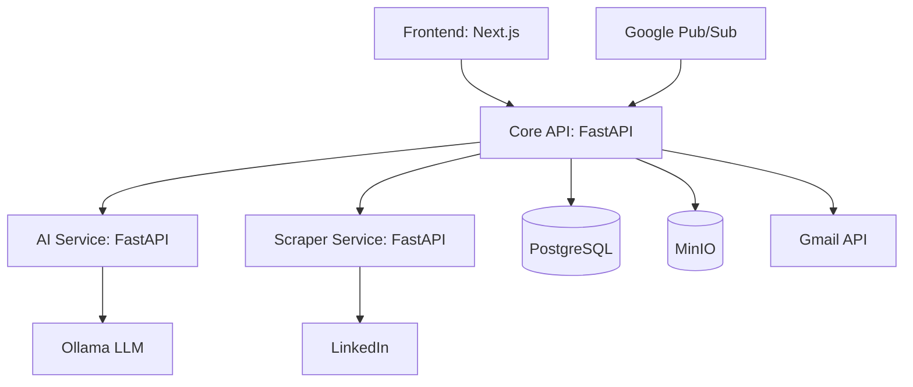
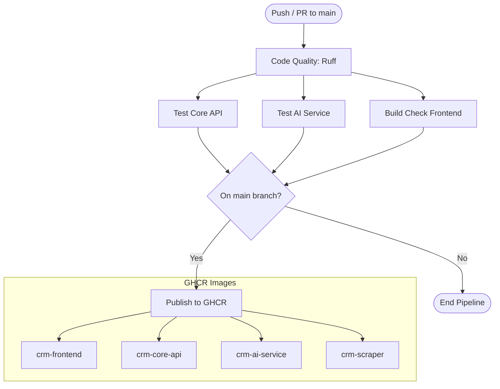
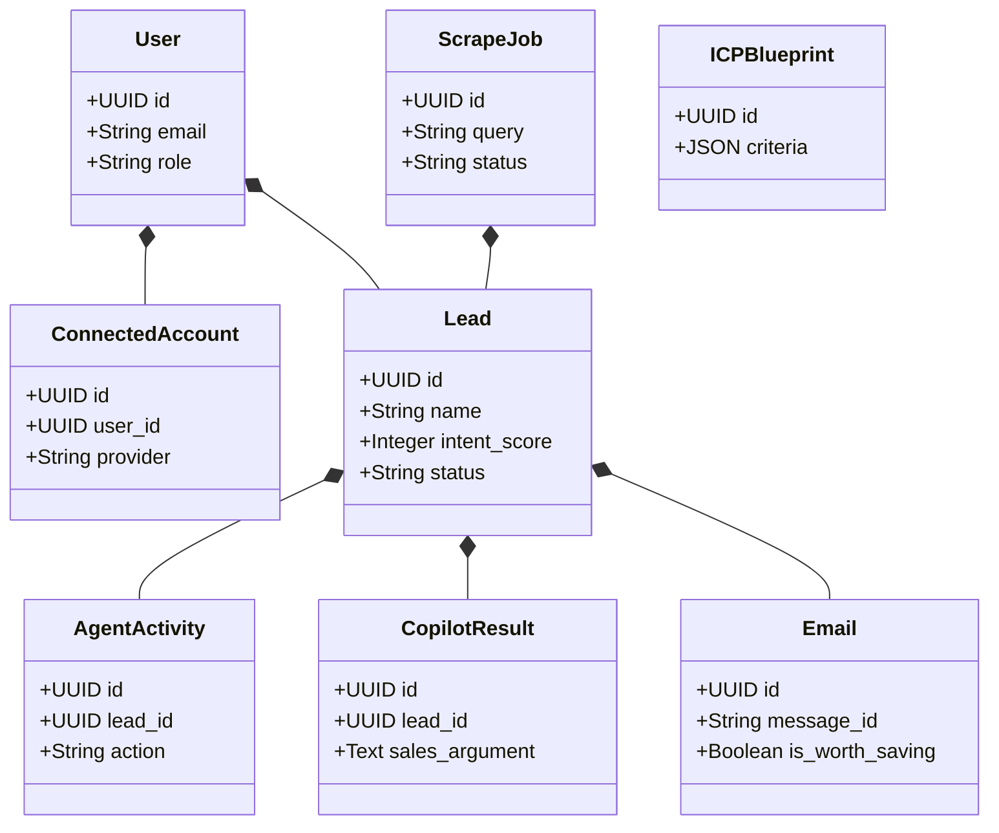
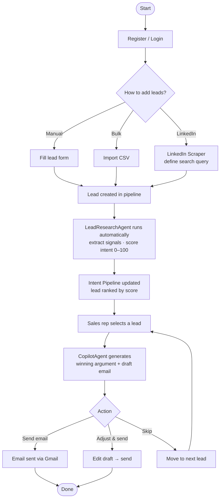
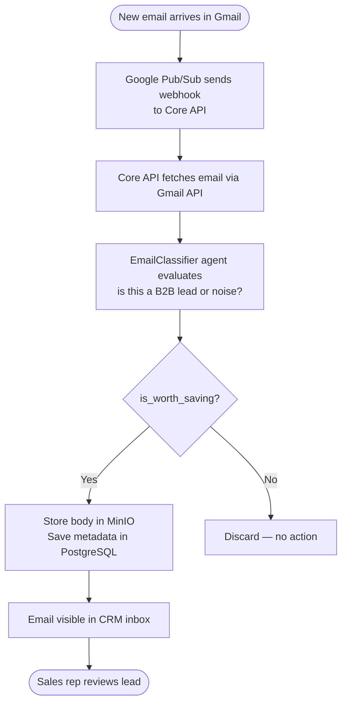
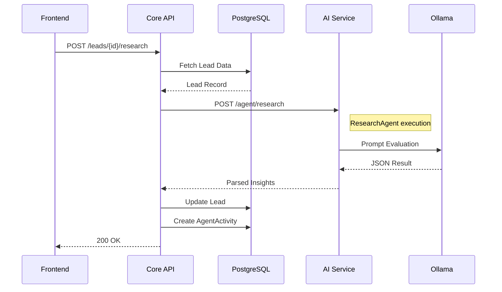
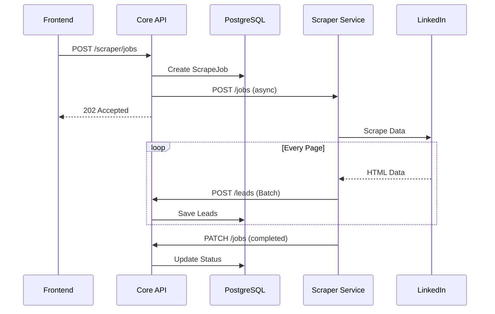
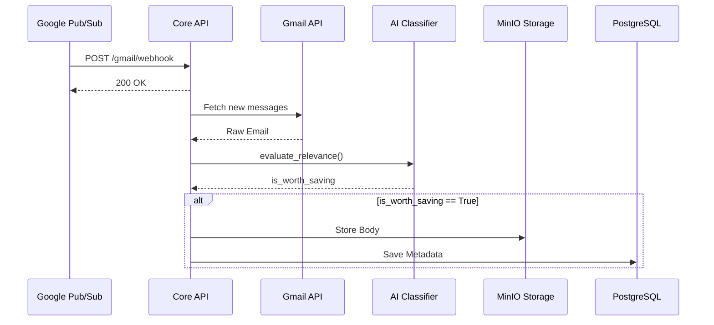

# CRM Agentic AI

Un CRM cu agenți AI care analizează lead-uri în timp real, calculează scorul de intenție și generează sugestii personalizate pentru vânzători.

Interfața are 3 coloane:
- **Activity Feed** — activitățile agenților AI în timp real
- **Intent Pipeline** — lead-urile sortate după scorul de intenție calculat de AI
- **Co-pilot Sidebar** — winning argument + draft mesaj personalizat per lead

---

## MDS 2026 — Development Process Checklist

| # | Cerință barem | Link |
|---|---|---|
| A | **2+ agenți AI funcționali** | LeadResearchAgent, CopilotAgent, SearchQueryAgent, EmailClassifier — vezi [Funcționalități](#funcționalități) |
| B1 | **User stories (min 10) + backlog creat cu AI** | [User Stories](#user-stories) · [Jira Backlog](https://crm-agentic-ai.atlassian.net/jira/software/projects/CRM/boards/35/backlog) |
| B2 | **Diagrame UML / arhitectură** | [System Architecture Diagrams](#system-architecture-diagrams) |
| B3 | **Source control: branches, PRs, min 5 commits/student** | [Pull Requests](https://github.com/vladinsc/-CRM-Agentic-AI/pulls?q=is%3Apr+is%3Amerged) · [Commits](https://github.com/vladinsc/-CRM-Agentic-AI/commits/main) |
| B4 | **Teste automate + evals agenți** | [`core-api/tests/`](./core-api/tests) · [`ai-service/tests/`](./ai-service/tests) |
| B5 | **Bug report + rezolvare cu PR** | [Issue #16](https://github.com/vladinsc/-CRM-Agentic-AI/issues/16) · [PR #11](https://github.com/vladinsc/-CRM-Agentic-AI/pull/11) |
| B6 | **Pipeline CI/CD** | [GitHub Actions](https://github.com/vladinsc/-CRM-Agentic-AI/actions) · [`.github/workflows/ci-cd.yml`](./.github/workflows/ci-cd.yml) |
| B7 | **Raport tooluri AI în dezvoltare** | [`AI_TOOLS_REPORT.md`](./AI_TOOLS_REPORT.md) |

---

## Funcționalități

- **Autentificare completă** — register, login/logout, verificare email, forgot/reset password
- **Lead Pipeline** — adaugă, vizualizează, șterge lead-uri; import CSV; scraper LinkedIn
- **4 Agenți AI:**
  - `LeadResearchAgent` — analizează profilul unui lead, extrage semnale de cumpărare, calculează scor de intenție 0–100 (pornit automat la crearea unui lead)
  - `CopilotAgent` — generează winning argument + draft email personalizat per lead (tier-based: HOT / WARM / COLD / LOST)
  - `SearchQueryAgent` — generează query-uri de căutare LinkedIn din ICP
  - `EmailClassifier` — clasifică emailuri primite prin Gmail
- **ICP Builder** — definești profilul clientului ideal în limbaj natural; AI-ul îl folosește la ranking
- **Gmail Integration** — conectare cont Google, monitorizare inbox prin Pub/Sub
- **Settings** — profil utilizator, conturi conectate, info platformă
- **Responsive** — funcționează pe mobile, tabletă și desktop
- **CI/CD** — GitHub Actions: lint → teste → build Docker → publish GHCR

---

## Pornire rapidă

### 1. Cerințe

**Windows / macOS**
- [Docker Desktop](https://www.docker.com/products/docker-desktop/) instalat și pornit

**Linux**
```bash
curl -fsSL https://get.docker.com | sh
sudo apt-get install -y docker-compose-plugin
sudo systemctl start docker
sudo usermod -aG docker $USER && newgrp docker
```

### 2. Clonează repo-ul

```bash
git clone https://github.com/vladinsc/-CRM-Agentic-AI.git
cd -CRM-Agentic-AI
```

### 3. Pornește serviciile

```bash
docker compose up -d
```

> Migrațiile bazei de date rulează automat la pornire.

### 4. Descarcă modelele AI (o singură dată)

```bash
docker exec crm-ollama ollama pull llama3.2:3b   # ~2GB — Research, Copilot, Email Classifier
docker exec crm-ollama ollama pull llama3.1:8b   # ~5GB — SearchQueryAgent
```

### 5. Accesează aplicația

| Serviciu | URL |
|---|---|
| Frontend | http://localhost:3000 |
| Core API (docs) | http://localhost:8000/docs |
| AI Service (docs) | http://localhost:8001/docs |
| MinIO Console | http://localhost:9001 |

---

## Stack

| Layer | Tehnologie |
|---|---|
| Frontend | Next.js 16 + React 19 + TypeScript + Tailwind CSS + shadcn/ui |
| Core API | FastAPI + SQLAlchemy + Alembic + PostgreSQL |
| AI Service | FastAPI + Ollama (llama3.2:3b / llama3.1:8b) |
| Scraper | FastAPI + Playwright |
| Infra | Docker Compose (8 containere) |
| CI/CD | GitHub Actions + GHCR |

---

## Comenzi utile

```bash
docker compose up --build          # rebuild și pornește tot
docker compose down                # oprește (păstrează volumele)
docker compose down -v             # oprește + șterge toate datele
docker compose logs core-api -f    # urmărește logurile unui serviciu

# Teste
cd core-api && python -m pytest tests/ -q
cd ai-service && python -m pytest tests/ -q
```

---

## User Stories

| # | User Story |
|---|---|
| 1 | As a sales rep, I want to register with my email and password so that I can access my private CRM workspace |
| 2 | As a user, I want to reset my password via email so that I can recover access to my account if I forget my credentials |
| 3 | As a sales rep, I want to import leads from a CSV file so that I can bulk-add prospects without manual entry |
| 4 | As a sales rep, I want to update a lead's status so that I can track where each prospect is in my pipeline |
| 5 | As a sales rep, I want the AI to automatically research a new lead and calculate an intent score so that I can prioritize who to contact first |
| 6 | As a sales rep, I want to see AI agent activity in an auto-updating feed so that I know what research is being done in the background |
| 7 | As a sales rep, I want the AI to generate a personalized draft email for each lead so that I can send outreach without writing from scratch |
| 8 | As a sales rep, I want to send the AI-drafted email directly from the CRM so that I don't have to switch to Gmail manually |
| 9 | As a sales manager, I want to define my Ideal Customer Profile in plain language so that I have a clear reference of who my ideal customer is |
| 10 | As a sales rep, I want to scrape LinkedIn Sales Navigator search results so that I can automatically import qualified prospects into my CRM |
| 11 | As a sales rep, I want to use the Chrome extension to scrape LinkedIn leads from my own browser so that I don't need to share my LinkedIn credentials with the server |
| 12 | As a sales rep, I want the AI to suggest LinkedIn search queries based on my existing leads so that I can find similar high-intent prospects faster |
| 13 | As a sales rep, I want incoming emails to be automatically classified as leads or noise so that I don't miss potential business opportunities in my inbox |
| 14 | As a developer, I want every pull request to run automated tests and lint checks so that broken code is caught before it reaches production |
| 15 | As a user, I want to connect my Google account to the CRM and monitor my Gmail inbox so that I can receive and classify leads without leaving the platform |

---

## System Architecture Diagrams

### 1. High-Level Architecture


### 2. CI/CD Pipeline


### 3. Class Diagram (Data Models)


### 3. User Flow — Main Journey


### 4. User Flow — Gmail Email Classification


### 6. Lead Research Flow (Technical)


### 7. LinkedIn Scraping Flow (Technical)


### 8. Gmail Integration Flow (Technical)

